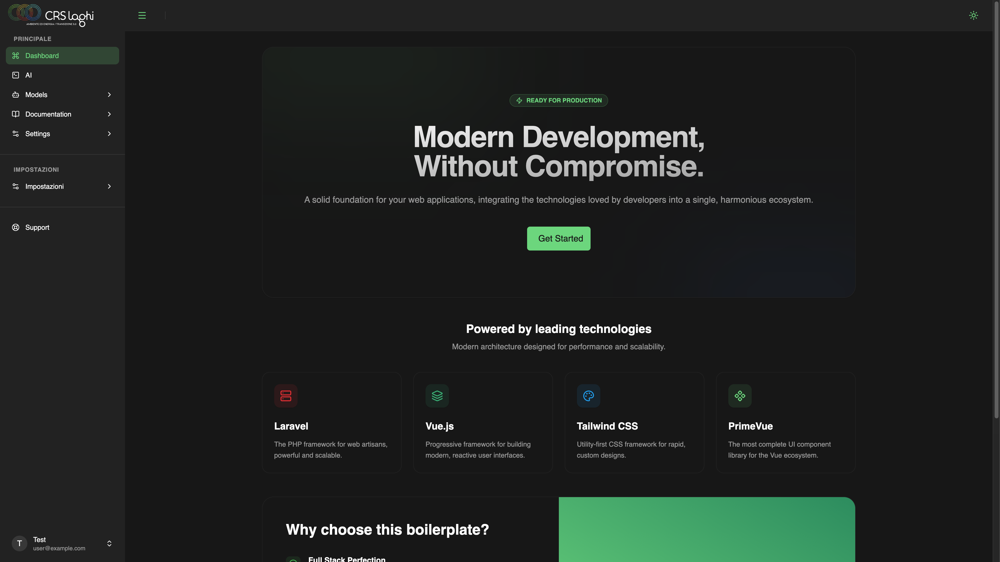

# Laravel PrimeVue Starter Kit

A modern and robust starter kit based on **Laravel 13**, **Inertia.js v3**, **Vue 3**, **PrimeVue v4**, and **Tailwind CSS v4**.



## 🚀 Key Features

- **Modern Tech Stack**: Laravel 13, Vue 3 (Composition API), and Inertia.js v3.
- **Professional UI**: PrimeVue v4 with a custom preset and Tailwind CSS v4 integration.
- **Native Dark Mode**: Full dark mode support with persistence and system synchronization.
- **Authentication**: Pre-configured with Laravel Fortify.
- **Icons**: Seamless integration with Lucide Vue Next and PrimeIcons.
- **Developer Experience**: Configured with Laravel Pint, Pest for testing, and Laravel Boost.
- **Fully Responsive**: Optimized design for mobile, tablet, and desktop.

## 🛠️ Prerequisites

- PHP >= 8.3
- Node.js & NPM
- Composer

## 📦 Installation

1. **Clone the repository**:
   ```bash
   git clone <repository-url>
   cd boilerplate
   ```

2. **Automatic Setup**:
   We've included a setup script that handles dependency installation, key generation, migrations, and asset building:
   ```bash
   composer run setup
   ```


## 💻 Development

To start the development environment (Artisan server, Vite, logs, etc.):

```bash
composer run dev
```

The project will be accessible at the URL configured in your `.env` file (typically `http://localhost:8000` or via Laravel Herd).

## 🧪 Testing

Run your tests using Pest:

```bash
composer run test
```

## 🎨 Code Style

The project uses **Laravel Pint** to maintain a consistent code style.

```bash
vendor/bin/pint
```

## 📄 License

This project is open-source software licensed under the [MIT license](LICENSE).

---

Made with ❤️ by [CRS Laghi](https://www.crslaghi.net/it/)
